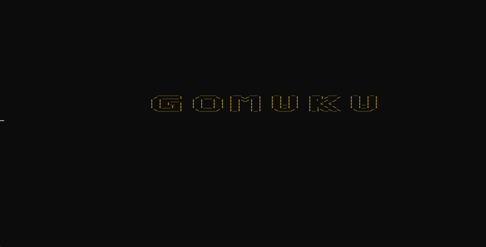
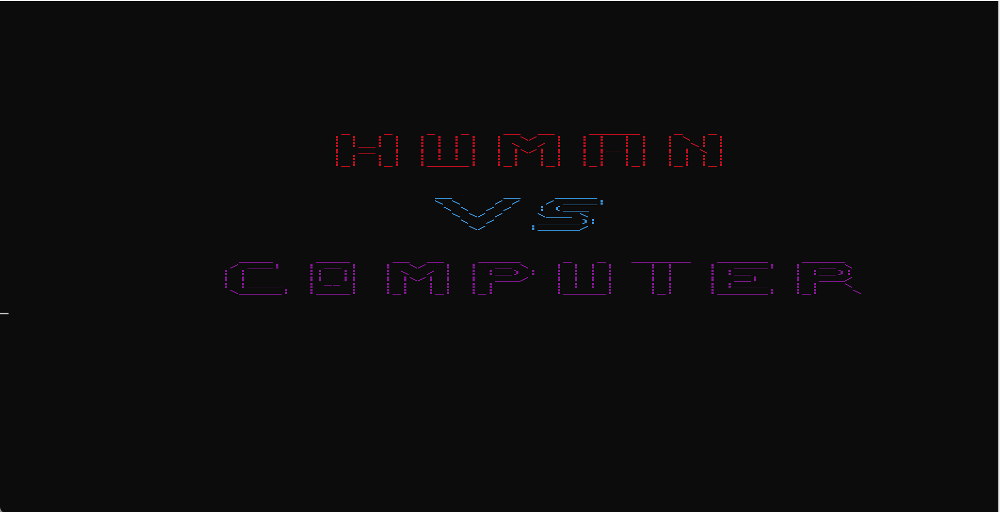
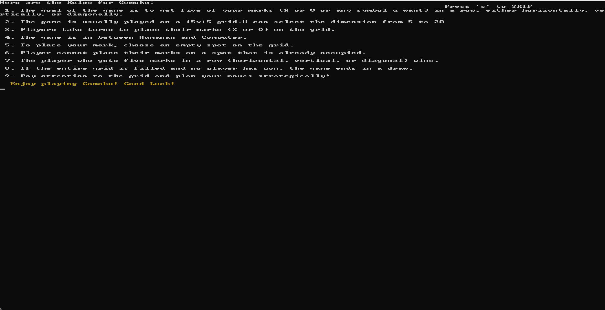
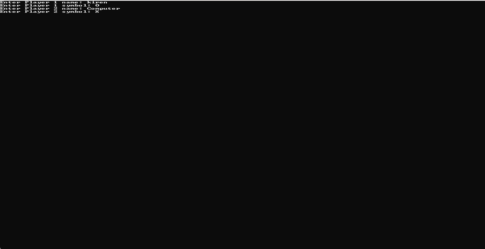

# ⚫ Gomoku AI

<p align="center">
  <b>A Console-Based Human vs Computer Gomoku Game built with C++</b>
  <br><br>
  Challenge an AI opponent in the classic Gomoku board game featuring customizable board sizes, tournament mode, and intelligent computer moves.
</p>

---

# 📖 Overview

**Gomoku AI** is a console implementation of the classic Gomoku (Five in a Row) game developed using **C++**.

The project allows a human player to compete against a computer opponent on a customizable game board. The game supports multiple tournament rounds, automatic score tracking, a leaderboard system, and intelligent computer move selection.

This project was developed to practice game development, dynamic memory management, algorithms, and console-based user interfaces in C++.

---

# 🎮 Gameplay

Your objective is simple:

> **Place five consecutive symbols before the computer does.**

Players alternate turns placing their symbols on the board. The first player to align five symbols horizontally, vertically, or diagonally wins the round. After several rounds, the overall tournament winner is announced.

---

# ✨ Features

- 🤖 Human vs Computer gameplay
- 🎯 Intelligent computer move selection
- 📐 Custom board size (5×5 to 20×20)
- 🏆 Tournament mode
- 📊 Leaderboard system
- 🎨 Colored console interface
- 🖱️ Mouse-based move selection
- ✅ Win detection in all directions
- 🤝 Draw detection
- 🔄 Multiple rounds

---

# 🛠 Tech Stack

| Technology | Purpose |
|------------|---------|
| C++ | Programming Language |
| Windows Console API | Console Graphics |
| Dynamic Memory Allocation | Game Board |
| Git | Version Control |
| GitHub | Repository Hosting |

---

# 🎮 How to Play

1. Launch the game.
2. Read the instructions.
3. Select the board size (5–20).
4. Enter your player name.
5. Play against the computer.
6. Place five symbols in a row to win.
7. Compete across multiple rounds to become the tournament champion.

---

# 📸 Screenshots

## 🎮 Game Title



---

## 🚀 Start Screen



---

## 👤 Player Setup



---

## 🎯 Gameplay



---

# 🏗 Game Flow

```text
Launch Game
      │
      ▼
 Welcome Screen
      │
      ▼
 Instructions
      │
      ▼
 Select Board Size
      │
      ▼
 Enter Player Name
      │
      ▼
 Human Turn
      │
      ▼
 Computer Turn
      │
      ▼
 Five in a Row?
      │
      ├── Yes → Round Winner
      └── No
      │
      ▼
 Next Round
      │
      ▼
 Tournament Leaderboard
      │
      ▼
 Tournament Winner
```

---

# 📂 Project Structure

```text
Gomoku-AI
│
├── Gomuko.cpp
├── Screenshots
│   ├── Scene1.png
│   ├── Scene2.png
│   ├── Scene3.png
│   └── Scene4.png
├── README.md
└── ...
```

---

# 🚀 Key Concepts Implemented

- Dynamic game board generation
- Human vs Computer gameplay
- Basic AI move selection
- Tournament system
- Leaderboard management
- Win detection algorithms
- Draw detection
- Dynamic memory allocation
- Mouse event handling
- Console graphics

---

# 📚 Learning Outcomes

This project helped me strengthen my understanding of:

- C++ programming
- Dynamic memory allocation
- Two-dimensional arrays
- Game algorithms
- AI decision making
- Event handling
- Console graphics
- Debugging
- Git & GitHub

---

# 🚧 Future Improvements

Planned enhancements include:

- Stronger AI using Minimax algorithm
- Difficulty levels
- Graphical user interface
- Save & Load functionality
- Online multiplayer
- Better animations
- Sound effects

---

# 👨‍💻 Author

**Kiren Saleem**

This project was developed as part of my C++ learning journey to explore artificial intelligence concepts, game algorithms, dynamic memory management, and console-based game development through a Human vs Computer implementation of Gomoku.

---

## ⭐ Support

If you found this project interesting, consider giving the repository a **⭐ Star**.
